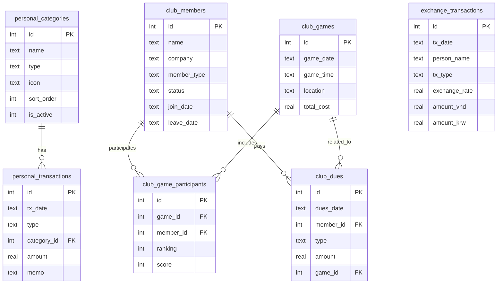

# 🏗️ 시스템 설계서 (System Design Document)

> **프로젝트**: 개인 자산 및 회사 모임(총무) 통합 대시보드
> **기본 화폐**: VND (베트남 동)
> **문서 버전**: v1.0
> **최종 수정일**: 2026-07-21
>
> ⚠️ **블록 관리 규칙**: 이 문서는 `<!-- BLOCK-XX START -->` ~ `<!-- BLOCK-XX END -->` 마커로 구분됩니다.
> 업데이트 시 해당 블록의 START/END 마커 내부만 수정하고, 다른 블록은 절대 건드리지 마세요.

---

<!-- BLOCK-00 START -->
## BLOCK-00: 과제 격리 및 멀티태스크 관리 (Task Isolation)
> **버전**: v1.0 | **최종 수정**: 2026-07-21

### 0.1 문제 정의

여러 AI 대시보드 과제(프로젝트)가 동시에 존재할 때, 한 과제의 데이터나 설정이 다른 과제에 영향을 주지 않도록 격리(Isolation)해야 합니다.

### 0.2 격리 전략

#### 방법 1: 프로젝트별 독립 디렉토리 (권장)
```
G:\AI\
├── 01_ProjectA\          ← 과제 A (독립 앱)
├── 02_ProjectB\          ← 과제 B (독립 앱)
├── 03_ProjectC\          ← 과제 C (독립 앱)
└── 04_DY_GOLF\           ← 본 과제 (모임 & 골프 관리 대시보드)
    ├── PROGRESS_TRACKER.md
    ├── SYSTEM_DESIGN.md
    ├── AI_PROMPT_GUIDE.md
    ├── src\
    ├── public\
    └── package.json
```
- 각 과제는 **완전히 독립된 디렉토리**에서 운영
- `npm run dev`로 실행 시 **포트를 다르게 지정** (예: 과제A=5173, 본 과제=5174)

#### 방법 2: 데이터 격리 (LocalStorage / DB)
- **LocalStorage 키 네임스페이스**: 모든 키에 프로젝트 접두사 부여
  ```
  mony_usage_personal_ledger_data
  mony_usage_club_ledger_data
  mony_usage_exchange_data
  mony_usage_settings
  ```
- **DB 기반 격리**: 프로젝트별 별도 DB 파일 또는 Schema 사용
  ```
  04_DY_GOLF/data/mony_usage.sqlite
  ```

#### 방법 3: 실행 포트 격리
```json
// package.json 내 scripts
{
  "scripts": {
    "dev": "vite --port 5174 --open"
  }
}
```

### 0.3 본 과제 적용 기준

| 항목 | 적용 값 |
|---|---|
| 프로젝트 디렉토리 | `g:\AI\04_DY_GOLF` |
| 개발 서버 포트 | `5174` |
| LocalStorage 접두사 | `mony_usage_` |
| DB 파일 (옵션) | `data/mony_usage.sqlite` |

<!-- BLOCK-00 END -->

---

<!-- BLOCK-01 START -->
## BLOCK-01: 메뉴 및 네비게이션 구조 (Navigation)
> **버전**: v1.0 | **최종 수정**: 2026-07-21

### 1.1 사이드바 메뉴 트리

```
📊 대시보드 (Dashboard)             ← 통합 요약 화면 (홈)
├── 💰 개인 가계부 (Personal Ledger)
│   ├── 수입/지출 입력
│   ├── 내역 조회 (일별/주별/월별)
│   └── 카테고리 관리
├── ⛳ 회사 모임 관리 (Company Club)
│   ├── 게임 기록 입력
│   ├── 멤버 관리
│   ├── 회비 관리
│   └── 순위/성적 조회
├── 💱 환전 관리 (Exchange Ledger)
│   ├── 환전 기록 입력
│   └── 환전 내역 조회
├── 📈 자산 현황 및 통계 (Analytics)
│   ├── 개인 지출 분석 그래프
│   ├── 모임 멤버별 성적 그래프
│   └── 환전 현황 차트
└── ⚙️ 설정 (Settings)
    ├── 카테고리 관리
    ├── 환율 기본값 설정
    └── 데이터 백업/복원
```

### 1.2 라우팅 구조

| 경로 | 페이지 | 설명 |
|---|---|---|
| `/` | Dashboard | 통합 요약 대시보드 |
| `/personal` | Personal Ledger | 개인 가계부 |
| `/personal/input` | Input Form | 수입/지출 입력 |
| `/personal/history` | History | 내역 조회 |
| `/club` | Company Club | 회사 모임 관리 |
| `/club/game` | Game Record | 게임 기록 입력 |
| `/club/members` | Member Mgmt | 멤버 관리 |
| `/club/dues` | Dues Mgmt | 회비 관리 |
| `/club/ranking` | Ranking | 순위/성적 조회 |
| `/exchange` | Exchange Ledger | 환전 관리 |
| `/analytics` | Analytics | 자산 현황 및 통계 |
| `/settings` | Settings | 설정 |

<!-- BLOCK-01 END -->

---

<!-- BLOCK-02 START -->
## BLOCK-02: 개인 가계부 — Personal Ledger (모듈 A)
> **버전**: v1.0 | **최종 수정**: 2026-07-21

### 2.1 기능 요약

- 사용자 정의 카테고리로 수입/지출 내역을 자유롭게 기입
- 기간별 조회: 일별, 주간, 월별 사용 금액 및 잔액 통계
- 입력 데이터: 날짜, 구분(입금/지출), 카테고리, 금액(VND), 메모

### 2.2 데이터베이스 스키마

#### 테이블: `personal_categories`
```sql
CREATE TABLE personal_categories (
    id            INTEGER PRIMARY KEY AUTOINCREMENT,
    name          TEXT    NOT NULL UNIQUE,       -- 카테고리명 (예: 식비, 교통비, 급여)
    type          TEXT    NOT NULL CHECK(type IN ('income', 'expense')), -- 수입/지출 구분
    icon          TEXT    DEFAULT '💰',           -- 아이콘 (선택)
    sort_order    INTEGER DEFAULT 0,
    is_active     INTEGER DEFAULT 1,             -- 활성/비활성
    created_at    TEXT    DEFAULT (datetime('now','localtime')),
    updated_at    TEXT    DEFAULT (datetime('now','localtime'))
);
```

#### 테이블: `personal_transactions`
```sql
CREATE TABLE personal_transactions (
    id            INTEGER PRIMARY KEY AUTOINCREMENT,
    tx_date       TEXT    NOT NULL,               -- 거래 날짜 (YYYY-MM-DD)
    type          TEXT    NOT NULL CHECK(type IN ('income', 'expense')), -- 입금/지출
    category_id   INTEGER NOT NULL,               -- FK → personal_categories.id
    amount        REAL    NOT NULL CHECK(amount > 0), -- 금액 (VND)
    memo          TEXT    DEFAULT '',              -- 메모
    created_at    TEXT    DEFAULT (datetime('now','localtime')),
    updated_at    TEXT    DEFAULT (datetime('now','localtime')),
    FOREIGN KEY (category_id) REFERENCES personal_categories(id)
);
```

### 2.3 주요 쿼리 예시

```sql
-- 월별 수입/지출 합계
SELECT
    strftime('%Y-%m', tx_date) AS month,
    type,
    SUM(amount) AS total
FROM personal_transactions
GROUP BY month, type
ORDER BY month DESC;

-- 카테고리별 지출 분석 (특정 월)
SELECT
    c.name AS category,
    SUM(t.amount) AS total
FROM personal_transactions t
JOIN personal_categories c ON t.category_id = c.id
WHERE t.type = 'expense'
  AND strftime('%Y-%m', t.tx_date) = '2026-07'
GROUP BY c.name
ORDER BY total DESC;

-- 잔액 계산 (전체 기간)
SELECT
    SUM(CASE WHEN type = 'income' THEN amount ELSE 0 END) -
    SUM(CASE WHEN type = 'expense' THEN amount ELSE 0 END) AS balance
FROM personal_transactions;
```

### 2.4 UI 컴포넌트

| 컴포넌트 | 설명 |
|---|---|
| `TransactionForm` | 수입/지출 입력 폼 (날짜, 구분, 카테고리 드롭다운, 금액, 메모) |
| `TransactionList` | 거래 내역 목록 (필터: 기간, 구분, 카테고리) |
| `CategoryManager` | 카테고리 CRUD (추가/수정/삭제/순서변경) |
| `PeriodSummary` | 기간별 요약 카드 (일/주/월 합계, 잔액) |

<!-- BLOCK-02 END -->

---

<!-- BLOCK-03 START -->
## BLOCK-03: 회사 모임 관리 — Company Club Ledger (모듈 B)
> **버전**: v1.0 | **최종 수정**: 2026-07-21

### 3.1 기능 요약

- 비정기 골프 모임(주 1~2회) 관리
- 유동적 참여 인원(2~8명) 관리, 단기 출장자 포함
- 게임별 순위 기록 및 등수 변동 시각화
- 회비 입출금 현황 관리

### 3.2 데이터베이스 스키마

#### 테이블: `club_members`
```sql
CREATE TABLE club_members (
    id            INTEGER PRIMARY KEY AUTOINCREMENT,
    name          TEXT    NOT NULL,               -- 멤버 이름
    company       TEXT    DEFAULT '현지',          -- 소속 (현지/본사)
    member_type   TEXT    NOT NULL CHECK(member_type IN ('regular', 'temporary')),
                                                  -- regular: 상시멤버, temporary: 단기출장자
    status        TEXT    DEFAULT 'active' CHECK(status IN ('active', 'inactive', 'departed')),
                                                  -- active: 활동중, inactive: 비활동, departed: 퇴사
    join_date     TEXT    NOT NULL,               -- 합류일
    leave_date    TEXT    DEFAULT NULL,            -- 퇴사/이탈일 (NULL이면 현재 활동중)
    memo          TEXT    DEFAULT '',
    created_at    TEXT    DEFAULT (datetime('now','localtime')),
    updated_at    TEXT    DEFAULT (datetime('now','localtime'))
);
```

#### 테이블: `club_games`
```sql
CREATE TABLE club_games (
    id            INTEGER PRIMARY KEY AUTOINCREMENT,
    game_date     TEXT    NOT NULL,               -- 게임 일시 (YYYY-MM-DD)
    game_time     TEXT    DEFAULT NULL,            -- 게임 시간 (HH:MM, 선택)
    location      TEXT    DEFAULT '스크린골프장',    -- 장소
    total_cost    REAL    DEFAULT 0,               -- 총 비용 (VND)
    memo          TEXT    DEFAULT '',
    created_at    TEXT    DEFAULT (datetime('now','localtime')),
    updated_at    TEXT    DEFAULT (datetime('now','localtime'))
);
```

#### 테이블: `club_game_participants`
```sql
CREATE TABLE club_game_participants (
    id            INTEGER PRIMARY KEY AUTOINCREMENT,
    game_id       INTEGER NOT NULL,               -- FK → club_games.id
    member_id     INTEGER NOT NULL,               -- FK → club_members.id
    ranking       INTEGER DEFAULT NULL,            -- 순위 (1등, 2등, ... 꼴찌)
    score         INTEGER DEFAULT NULL,            -- 스코어 (선택)
    created_at    TEXT    DEFAULT (datetime('now','localtime')),
    FOREIGN KEY (game_id) REFERENCES club_games(id),
    FOREIGN KEY (member_id) REFERENCES club_members(id),
    UNIQUE(game_id, member_id)
);
```

#### 테이블: `club_dues` (회비 입출금)
```sql
CREATE TABLE club_dues (
    id            INTEGER PRIMARY KEY AUTOINCREMENT,
    dues_date     TEXT    NOT NULL,               -- 거래 날짜
    member_id     INTEGER NOT NULL,               -- FK → club_members.id
    type          TEXT    NOT NULL CHECK(type IN ('deposit', 'withdrawal')),
                                                  -- deposit: 회비 입금, withdrawal: 사용/출금
    amount        REAL    NOT NULL CHECK(amount > 0), -- 금액 (VND)
    game_id       INTEGER DEFAULT NULL,            -- 연관 게임 ID (선택, FK → club_games.id)
    memo          TEXT    DEFAULT '',
    created_at    TEXT    DEFAULT (datetime('now','localtime')),
    updated_at    TEXT    DEFAULT (datetime('now','localtime')),
    FOREIGN KEY (member_id) REFERENCES club_members(id),
    FOREIGN KEY (game_id) REFERENCES club_games(id)
);
```

### 3.3 주요 쿼리 예시

```sql
-- 멤버별 평균 순위 (전체 기간)
SELECT
    m.name,
    ROUND(AVG(p.ranking), 1) AS avg_rank,
    COUNT(p.game_id) AS games_played
FROM club_game_participants p
JOIN club_members m ON p.member_id = m.id
GROUP BY m.id
ORDER BY avg_rank ASC;

-- 특정 멤버의 등수 변동 추이 (그래프 데이터)
SELECT
    g.game_date,
    p.ranking
FROM club_game_participants p
JOIN club_games g ON p.game_id = g.id
WHERE p.member_id = ?
ORDER BY g.game_date ASC;

-- 멤버별 회비 잔액
SELECT
    m.name,
    SUM(CASE WHEN d.type = 'deposit' THEN d.amount ELSE 0 END) -
    SUM(CASE WHEN d.type = 'withdrawal' THEN d.amount ELSE 0 END) AS balance
FROM club_dues d
JOIN club_members m ON d.member_id = m.id
WHERE m.status = 'active'
GROUP BY m.id
ORDER BY m.name;

-- 활성 멤버 목록 (단기 출장자 포함/구분)
SELECT
    name, member_type, company, status, join_date
FROM club_members
WHERE status = 'active'
ORDER BY member_type, name;
```

### 3.4 멤버 유동성 관리 로직

```
┌─────────────────────────────────────────────────┐
│           멤버 상태 전이 (State Machine)           │
├─────────────────────────────────────────────────┤
│                                                 │
│   [신규 합류] ──▶ active (regular/temporary)     │
│                      │                          │
│                      ├──▶ inactive (일시 비활동)  │
│                      │      │                   │
│                      │      └──▶ active (복귀)   │
│                      │                          │
│                      └──▶ departed (퇴사/출국)    │
│                                                 │
│   ※ temporary 멤버: 출장 기간 종료 시 자동        │
│     inactive → departed 전환 고려               │
└─────────────────────────────────────────────────┘
```

### 3.5 UI 컴포넌트

| 컴포넌트 | 설명 |
|---|---|
| `GameRecordForm` | 게임 기록 입력 (날짜, 참여자 체크, 순위 지정) |
| `MemberManager` | 멤버 CRUD (추가/상태변경/퇴사처리) |
| `DuesManager` | 회비 입출금 기록 및 잔액 조회 |
| `RankingChart` | 멤버별 등수 추이 라인 차트 |
| `GameHistory` | 게임 이력 목록 (필터: 기간, 멤버) |
| `MemberBadge` | 멤버 상태 표시 배지 (active/temporary/departed) |

<!-- BLOCK-03 END -->

---

<!-- BLOCK-04 START -->
## BLOCK-04: 환전 관리 — Exchange Ledger (모듈 C)
> **버전**: v1.0 | **최종 수정**: 2026-07-21

### 4.1 기능 요약

- 베트남 현지(VND)와 한국 본사 출장자 간 환전 거래 기록
- 양방향 환전 지원: VND→KRW, KRW→VND
- 적용 환율, 환전 금액, 출장자 정보 관리

### 4.2 데이터베이스 스키마

#### 테이블: `exchange_transactions`
```sql
CREATE TABLE exchange_transactions (
    id              INTEGER PRIMARY KEY AUTOINCREMENT,
    tx_date         TEXT    NOT NULL,               -- 거래 날짜 (YYYY-MM-DD)
    person_name     TEXT    NOT NULL,               -- 출장자 이름
    tx_type         TEXT    NOT NULL CHECK(tx_type IN ('VND_TO_KRW', 'KRW_TO_VND')),
                                                    -- VND_TO_KRW: VND 지급 → KRW 수령
                                                    -- KRW_TO_VND: KRW 지급 → VND 수령
    exchange_rate   REAL    NOT NULL,               -- 적용 환율 (예: 1 KRW = 18.5 VND)
    amount_vnd      REAL    NOT NULL CHECK(amount_vnd > 0),  -- VND 금액
    amount_krw      REAL    NOT NULL CHECK(amount_krw > 0),  -- KRW 금액
    memo            TEXT    DEFAULT '',              -- 비고
    created_at      TEXT    DEFAULT (datetime('now','localtime')),
    updated_at      TEXT    DEFAULT (datetime('now','localtime'))
);
```

### 4.3 환율 계산 로직

```
┌────────────────────────────────────────────────────────────┐
│  환전 유형별 계산                                            │
├────────────────────────────────────────────────────────────┤
│                                                            │
│  ■ VND_TO_KRW (내가 VND를 주고, 상대방이 KRW를 줌)          │
│    - 입력: amount_vnd, exchange_rate                       │
│    - 계산: amount_krw = amount_vnd / exchange_rate         │
│    - 예시: 1,000,000 VND ÷ 18.5 = 54,054 KRW             │
│                                                            │
│  ■ KRW_TO_VND (내가 KRW를 주고, 상대방이 VND를 줌)          │
│    - 입력: amount_krw, exchange_rate                       │
│    - 계산: amount_vnd = amount_krw × exchange_rate         │
│    - 예시: 100,000 KRW × 18.5 = 1,850,000 VND            │
│                                                            │
│  ※ exchange_rate 기준: 1 KRW = ? VND                       │
└────────────────────────────────────────────────────────────┘
```

### 4.4 주요 쿼리 예시

```sql
-- 출장자별 환전 이력
SELECT
    person_name,
    tx_date,
    tx_type,
    exchange_rate,
    amount_vnd,
    amount_krw,
    memo
FROM exchange_transactions
WHERE person_name = ?
ORDER BY tx_date DESC;

-- 월별 환전 총액
SELECT
    strftime('%Y-%m', tx_date) AS month,
    tx_type,
    SUM(amount_vnd) AS total_vnd,
    SUM(amount_krw) AS total_krw
FROM exchange_transactions
GROUP BY month, tx_type
ORDER BY month DESC;

-- 내 VND 순 유출/유입 계산
SELECT
    SUM(CASE WHEN tx_type = 'VND_TO_KRW' THEN -amount_vnd ELSE amount_vnd END) AS net_vnd,
    SUM(CASE WHEN tx_type = 'VND_TO_KRW' THEN amount_krw ELSE -amount_krw END) AS net_krw
FROM exchange_transactions;
```

### 4.5 UI 컴포넌트

| 컴포넌트 | 설명 |
|---|---|
| `ExchangeForm` | 환전 기록 입력 폼 (날짜, 출장자, 유형, 환율, 금액) |
| `ExchangeHistory` | 환전 이력 목록 (필터: 기간, 출장자, 유형) |
| `ExchangeCalculator` | 실시간 환전 계산기 (환율 입력 시 자동 계산) |
| `ExchangeSummary` | 환전 요약 카드 (총 VND/KRW 거래량) |

<!-- BLOCK-04 END -->

---

<!-- BLOCK-05 START -->
## BLOCK-05: 통합 대시보드 및 시각화 (Dashboard & Analytics)
> **버전**: v1.0 | **최종 수정**: 2026-07-21

### 5.1 대시보드 레이아웃

```
┌──────────────────────────────────────────────────────────────┐
│  📊 통합 대시보드                                      [설정] │
├──────────────────────────────────────────────────────────────┤
│                                                              │
│  ┌─────────────┐  ┌─────────────┐  ┌─────────────┐          │
│  │ 💰 개인 잔액  │  │ ⛳ 모임 잔액  │  │ 💱 환전 총액  │          │
│  │ 12,500,000  │  │  8,200,000  │  │  5,400,000  │          │
│  │     VND     │  │     VND     │  │     VND     │          │
│  └─────────────┘  └─────────────┘  └─────────────┘          │
│                                                              │
│  ┌────────────────────────┐  ┌────────────────────────┐      │
│  │  개인 지출 추이 (월별)   │  │  모임 멤버별 등수 추이    │      │
│  │  [라인 차트]            │  │  [라인 차트]             │      │
│  │                        │  │                        │      │
│  │                        │  │                        │      │
│  └────────────────────────┘  └────────────────────────┘      │
│                                                              │
│  ┌────────────────────────┐  ┌────────────────────────┐      │
│  │  카테고리별 지출 비율     │  │  최근 활동 타임라인       │      │
│  │  [도넛 차트]            │  │  - 07/21 골프 게임 참여   │      │
│  │                        │  │  - 07/20 식비 지출       │      │
│  │                        │  │  - 07/19 환전 거래       │      │
│  └────────────────────────┘  └────────────────────────┘      │
│                                                              │
└──────────────────────────────────────────────────────────────┘
```

### 5.2 차트/그래프 사양

| 차트 | 유형 | 데이터 소스 | 설명 |
|---|---|---|---|
| 개인 지출 추이 | Line Chart | `personal_transactions` | 월별 수입/지출 추이 |
| 카테고리별 지출 | Doughnut Chart | `personal_transactions` | 카테고리별 지출 비율 |
| 멤버별 등수 추이 | Line Chart | `club_game_participants` | 게임별 각 멤버의 순위 변동 |
| 회비 잔액 현황 | Bar Chart | `club_dues` | 멤버별 회비 잔액 비교 |
| 환전 현황 | Bar Chart | `exchange_transactions` | 월별 VND/KRW 환전 규모 |
| 최근 활동 | Timeline | ALL | 최근 거래/게임/환전 이력 통합 |

### 5.3 대시보드 위젯 구성

| 위젯 | 데이터 |
|---|---|
| 개인 잔액 카드 | 총 수입 - 총 지출 = 잔액 (VND) |
| 모임 잔액 카드 | 총 회비 입금 - 총 사용 = 잔액 (VND) |
| 환전 총액 카드 | 총 VND 환전 규모 |
| 이번 달 지출 카드 | 당월 개인 지출 합계 |
| 최근 게임 카드 | 마지막 게임 날짜, 참여자, 1등 |
| 다음 예상 모임 | 최근 모임 빈도 기반 추정 |

### 5.4 Analytics 페이지 상세

- **개인 지출 분석**: 기간 선택 → 카테고리별 비중, 추이 그래프, 전월 대비 변동률
- **골프 모임 성적**: 멤버별 평균 순위, 최고/최저 기록, 참여율, 등수 변동 그래프
- **환전 분석**: 기간별 환율 변동, 환전 빈도, 누적 환전 금액

<!-- BLOCK-05 END -->

---

<!-- BLOCK-06 START -->
## BLOCK-06: 설정 (Settings)
> **버전**: v1.0 | **최종 수정**: 2026-07-21

### 6.1 설정 항목

| 설정 | 설명 | 기본값 |
|---|---|---|
| 기본 화폐 | 메인 화폐 단위 | VND |
| 기본 환율 | KRW↔VND 기본 환율 | 18.5 (1 KRW = 18.5 VND) |
| 테마 | 라이트/다크 모드 | 다크 |
| 언어 | 한국어/영어/베트남어 | 한국어 |
| 데이터 백업 | JSON 내보내기/가져오기 | — |
| 카테고리 관리 | 개인 가계부 카테고리 편집 | — |

### 6.2 데이터 백업/복원

```json
// 백업 파일 구조 (JSON)
{
  "export_info": {
    "version": "1.0",
    "project": "mony_usage",
    "exported_at": "2026-07-21T15:00:00+07:00"
  },
  "settings": { ... },
  "personal_categories": [ ... ],
  "personal_transactions": [ ... ],
  "club_members": [ ... ],
  "club_games": [ ... ],
  "club_game_participants": [ ... ],
  "club_dues": [ ... ],
  "exchange_transactions": [ ... ]
}
```

### 6.3 LocalStorage 키 맵

| 키 | 용도 |
|---|---|
| `mony_usage_settings` | 앱 설정 (테마, 언어, 환율 등) |
| `mony_usage_personal_categories` | 개인 가계부 카테고리 |
| `mony_usage_personal_transactions` | 개인 가계부 거래 내역 |
| `mony_usage_club_members` | 모임 멤버 목록 |
| `mony_usage_club_games` | 게임 기록 |
| `mony_usage_club_participants` | 게임 참여자 기록 |
| `mony_usage_club_dues` | 회비 입출금 기록 |
| `mony_usage_exchange_transactions` | 환전 거래 기록 |

<!-- BLOCK-06 END -->

---

## 📐 전체 ERD (Entity Relationship Diagram)


